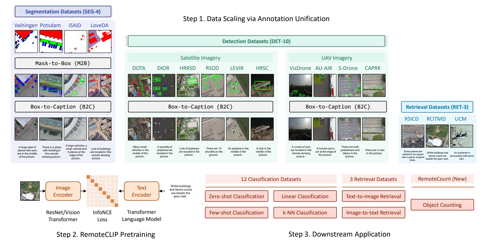
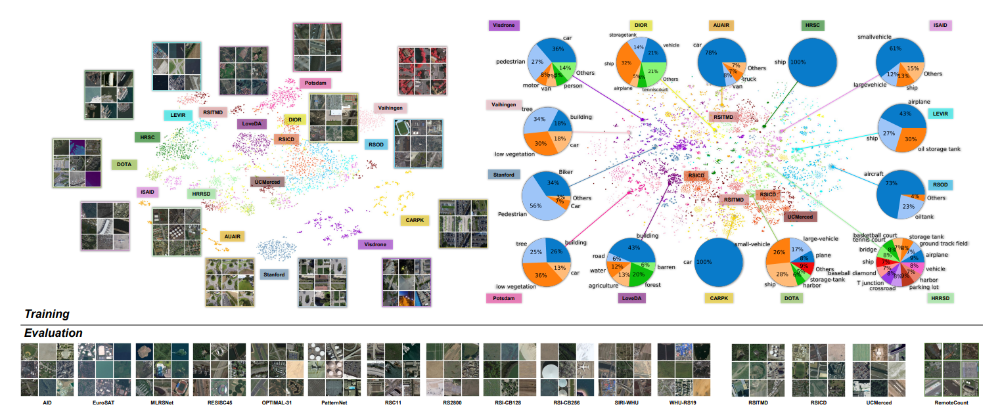
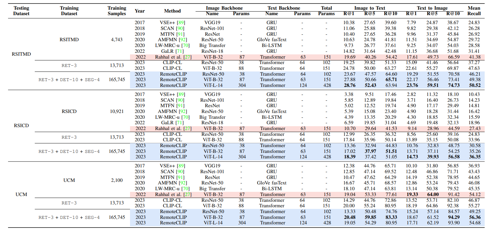

<div align="center">

## RemoteCLIP🛰️: A Vision Language Foundation Model for Remote Sensing

[Fan Liu (刘凡)](https://multimodality.group/author/%E5%88%98%E5%87%A1/)*
, &nbsp; &nbsp; 
[Delong Chen (陈德龙)](https://chendelong.world/)*
, &nbsp; &nbsp; 
[Zhangqingyun Guan (管张青云)](https://github.com/gzqy1026)


Xiaocong Zhou (周晓聪)
, &nbsp; &nbsp; 
Jiale Zhu (朱佳乐)
, &nbsp; &nbsp; 
[Jun Zhou (周峻)](https://experts.griffith.edu.au/7205-jun-zhou) 


 &nbsp; &nbsp;  &nbsp; &nbsp; 


\* Equal Contribution

</div>


### News
- **2023/11/07**: To facilitate reproducing RemoteCLIP's SOTA image-text retrieval results, we have prepared a `retrieval.py` script for retrieval evaluation on RSITMD, RSICD, and UCM datasets. Please see the [Retrieval Evaluation](#retrieval-evaluation) section for details.

- **2023/07/27**: We make pretrained checkpoints of RemoteCLIP models (`ResNet-50`, `ViT-base-32`, and `ViT-large-14`) available! We converted the weights to the [`OpenCLIP`](https://github.com/mlfoundations/open_clip) format, such that loading and using RemoteCLIP is extremely easy! Please see the [Load RemoteCLIP](#load-remoteclip) section for details. We also provide a Jupyter Notebook [demo.ipynb](demo.ipynb), and you can also [](https://colab.research.google.com/github/ChenDelong1999/RemoteCLIP/blob/main/RemoteCLIP_colab_demo.ipynb).

- **2023/06/19**: We propose RemoteCLIP, the first vision-language foundation model for remote sensing. The preprint of our RemoteCLIP paper is available online [[arXiv url]](https://arxiv.org/abs/2306.11029).

### Introduction

Welcome to the official repository of our paper "[*RemoteCLIP: A Vision Language Foundation Model for Remote Sensing*](https://arxiv.org/abs/2306.11029)"! 

General-purpose foundation models have become increasingly important in the field of artificial intelligence. While self-supervised learning (SSL) and Masked Image Modeling (MIM) have led to promising results in building such foundation models for remote sensing, these models primarily learn low-level features, require annotated data for fine-tuning, and are not applicable for retrieval and zero-shot applications due to the lack of language understanding. 

**In response to these limitations, we propose RemoteCLIP, the first vision-language foundation model for remote sensing that aims to learn robust visual features with rich semantics, as well as aligned text embeddings for seamless downstream application.** To address the scarcity of pre-training data, we leverage data scaling, converting heterogeneous annotations based on Box-to-Caption (B2C) and Mask-to-Box (M2B) conversion, and further incorporating UAV imagery, resulting in a 12xlarger pretraining dataset. 



RemoteCLIP can be applied to a variety of downstream tasks, including zero-shot image classification, linear probing, k-NN classification, few-shot classification, image-text retrieval, and object counting. Evaluations on 16 datasets, including a newly introduced RemoteCount benchmark to test the object counting ability, show that RemoteCLIP consistently outperforms baseline foundation models across different model scales. 



**Impressively, RemoteCLIP outperforms previous SoTA by 9.14% mean recall on the RSICD dataset and by 8.92% on RSICD dataset</u>. For zero-shot classification, our RemoteCLIP outperforms the CLIP baseline by up to 6.39% average accuracy on 12 downstream datasets.**




### Load RemoteCLIP

RemoteCLIP is trained with the [`ITRA`](https://itra.readthedocs.io) codebase, and we have converted the pretrained checkpoints to [`OpenCLIP`](https://github.com/mlfoundations/open_clip) compatible format and uploaded them to [[this Huggingface Repo]](https://huggingface.co/chendelong/RemoteCLIP/tree/main), such that accessing the model could be more convenient!

- To load RemoteCILP, please first prepare an environment with [OpenCLIP](https://github.com/mlfoundations/open_clip) installation, for example, by running this command:

    ```bash
    # https://pypi.org/project/open-clip-torch/
    pip install open-clip-torch
    ```

- Then, download the pretrained checkpoint from [huggingface](https://huggingface.co/chendelong/RemoteCLIP/tree/main), you can clone the repo with Git LFS, or download it automatically via [huggingface_hub](https://github.com/huggingface/huggingface_hub):

    ```python
    from huggingface_hub import hf_hub_download

    for model_name in ['RN50', 'ViT-B-32', 'ViT-L-14']:
        checkpoint_path = hf_hub_download("chendelong/RemoteCLIP", f"RemoteCLIP-{model_name}.pt", cache_dir='checkpoints')
        print(f'{model_name} is downloaded to {checkpoint_path}.')

    ```

- Now, you can initialize a CLIP model with `OpenCLIP`, then load the RemoteCLIP checkpoint with a few lines of code:

    ```python
    import torch, open_clip
    from PIL import Image

    model_name = 'ViT-L-14' # 'RN50' or 'ViT-B-32' or 'ViT-L-14'
    model, _, preprocess = open_clip.create_model_and_transforms(model_name)
    tokenizer = open_clip.get_tokenizer(model_name)

    ckpt = torch.load(f"path/to/your/checkpoints/RemoteCLIP-{model_name}.pt", map_location="cpu")
    message = model.load_state_dict(ckpt)
    print(message)

    model = model.cuda().eval()
    ```

- The following is an example of text-to-image retrieval with RemoteCILP:

    ```python
    text_queries = [
        "A busy airport with many airplanes.", 
        "Satellite view of Hohai University.", 
        "A building next to a lake.", 
        "Many people in a stadium.", 
        "a cute cat",
        ]
    text = tokenizer(text_queries)
    image = preprocess(Image.open("assets/airport.jpg")).unsqueeze(0)

    with torch.no_grad(), torch.cuda.amp.autocast():
        image_features = model.encode_image(image.cuda())
        text_features = model.encode_text(text.cuda())
        image_features /= image_features.norm(dim=-1, keepdim=True)
        text_features /= text_features.norm(dim=-1, keepdim=True)

        text_probs = (100.0 * image_features @ text_features.T).softmax(dim=-1).cpu().numpy()[0]

    print(f'Predictions of {model_name}:')
    for query, prob in zip(text_queries, text_probs):
        print(f"{query:<40} {prob * 100:5.1f}%")
    ```

    You could get the following outputs:
    ```
    Predictions of RN50:
    A busy airport with many airplanes.      100.0%
    Satellite view of Hohai University.        0.0%
    A building next to a lake.                 0.0%
    Many people in a stadium.                  0.0%
    a cute cat                                 0.0%
    ```

    <div align="center">
    
    </div>

    You can run the above code in [demo.ipynb](demo.ipynb), and you can also [](https://colab.research.google.com/github/ChenDelong1999/RemoteCLIP/blob/main/RemoteCLIP_colab_demo.ipynb) 


### Retrieval Evaluation
> We first present the performance
on RemoteCLIP on three remote sensing image-text retrieval
benchmarks (RSITMD, RSICD, UCM). To perform cross-modal retrieval with RemoteCLIP, we extract image and text representations on the
test split, perform L-2 normalization, and retrieval most similar
samples based on the dot-product similarity measure. We
show the retrieval recall of top-1 (R@1), top-5 (R@5), top-10 (R@10), and the mean recall of these values.

We have prepared a `retrieval.py` script to replicate the retrieval evaluation. Follow the steps below to evaluate the retrieval performance of RemoteCLIP on the RSITMD, RSICD, and UCM datasets:

- To run the retrieval evaluation, please first install additional dependencies: `pip install clip_benchmark`.
- Then download and extract image-text datasets [RSITMD](https://github.com/xiaoyuan1996/AMFMN/blob/master/RSITMD/README.md),
[RSICD](https://github.com/201528014227051/RSICD_optimal), and
[UCM](https://aistudio.baidu.com/datasetdetail/90740).
- Execute the following command to obtain image-to-text and text-to-image retrieval results:

    ```bash
    torchrun  remoteclip_retrieval.py \
    --model-name "ViT-B-32" \
    --retrieval-images-dir "/path/to/rsitmd/images" \
    --retrieval-json-dir "/path/to/dataset_rsitmd.json" \
    --remoteclip-path "/path/to/RemoteCLIP_ViT-B-32.pt"
    ```


### Acknowledgments

- Thanks Wenwen Cai (蔡雯雯) for her efforts on the RemoteCount dataset.
- Thanks [Dr. Gordon McDonald](https://github.com/gdmcdonald) for making Jupyter Notebook available in Colab!

### Citation

If you find this work useful, please cite our paper as:

```bibtex
@article{remoteclip,
  author       = {Fan Liu and
                  Delong Chen and
                  Zhangqingyun Guan and
                  Xiaocong Zhou and
                  Jiale Zhu and
                  Jun Zhou},
  title        = {RemoteCLIP: {A} Vision Language Foundation Model for Remote Sensing},
  journal      = {CoRR},
  volume       = {abs/2306.11029},
  year         = {2023},
  url          = {https://doi.org/10.48550/arXiv.2306.11029},
  doi          = {10.48550/arXiv.2306.11029}
}
```
